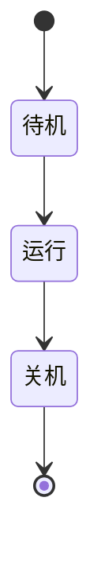
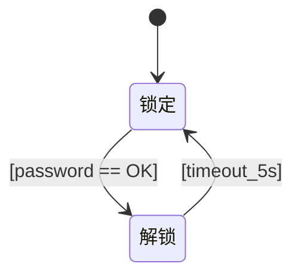
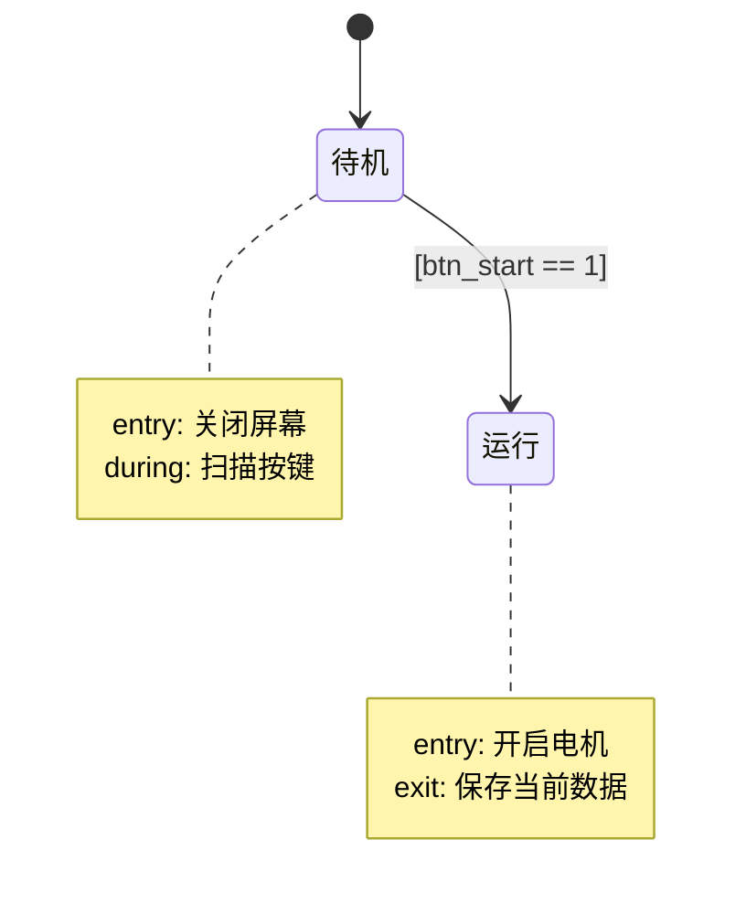
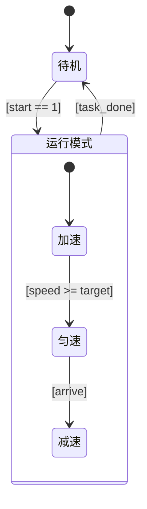
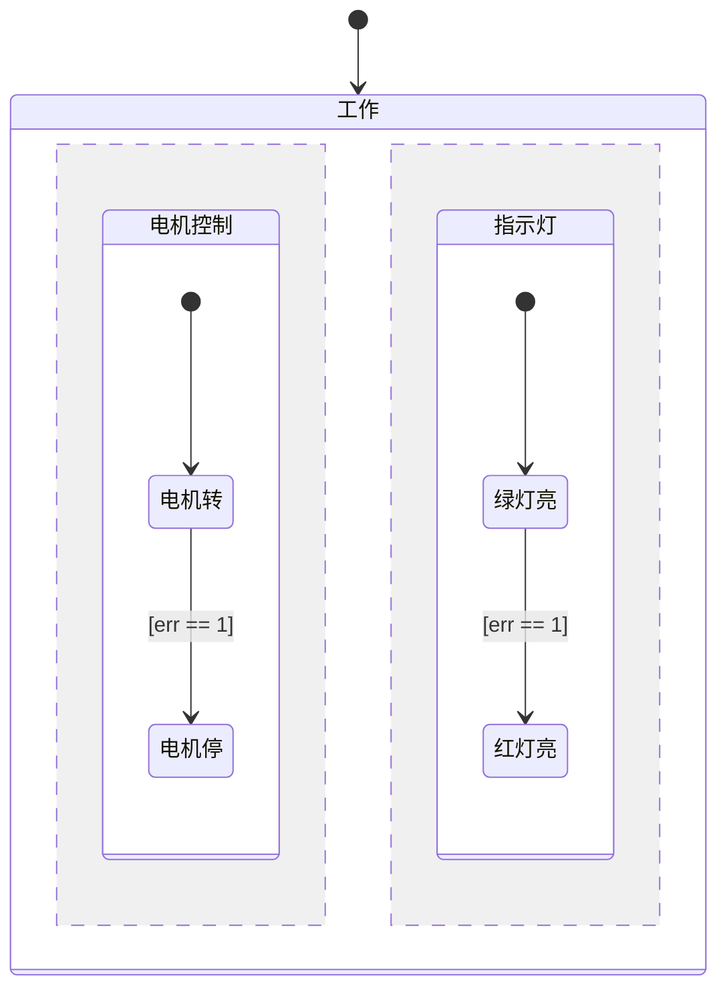
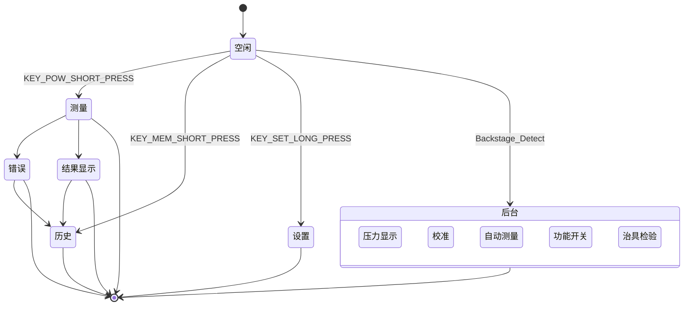

Mermaid 的语法设计非常符合直觉，只要你懂逻辑，哪怕没画过图，跟着本教程走，10分钟就能画出专业级的状态机。

---

### 🌟 核心心法：状态机的本质只有两件事
1. **有哪些状态？**（用方框表示）
2. **怎么跳转？**（用箭头表示，箭头上写触发条件）
所有的复杂状态机，都是这两个基本元素的组合。

---
### 第一步：最简状态机（定义状态与跳转）
使用 `stateDiagram-v2` 声明这是一个状态图。
状态直接写名字，跳转用 `-->` 箭头连接。


*💡 渲染效果：你会看到两个方框，中间有双向箭头。*

---
### 第二步：起止状态（标记生命周期的开头和结尾）
一个规范的状态机必须有起点和终点。Mermaid 用 `[*]` 表示。
*   `[*] --> 状态`：表示初始状态（上电默认状态）。
*   `状态 --> [*]`：表示终结状态（关机/销毁）。


---
### 第三步：给跳转加上条件（最关键的一步！）
没有条件的跳转是无意义的。在箭头后面加 `: 条件描述`，即可在箭头上显示文字。
🔥 **AI协作核心技巧**：为了让后续AI生成C代码更精准，**条件描述尽量用代码逻辑的写法**，比如 `[btn == 1]` 而不是 “按下按钮”。



---
### 第四步：状态动作（Entry / During / Exit）
在 Stateflow 中，状态有 entry（进入动作）、exit（退出动作）等。Mermaid 本身不直接执行动作，但我们可以用 **`note`（注释）** 完美表达，且AI完全能看懂！
语法：

```
note right of 状态名
    动作描述
end note
```


---
### 第五步：复合状态（嵌套状态 / 父子状态）
实际开发中，状态往往是包含关系的。比如“运行”状态下，又分为“加速”和“匀速”。
使用大括号 `{}` 将子状态包裹在父状态内部。**子状态也需要自己的 `[*]` 起点哦！**



*💡 渲染效果：你会看到一个大框叫“运行模式”，里面包含了加速和匀速两个小框。*

---
### 第六步：并行状态（并发 / AND状态）
有时候两个模块是独立同时运行的（比如电机控制和指示灯控制）。使用 `--` 分隔符将父状态切分为多个并行区域。


---
### 第七步：高级排版与别名（让图更清爽）
当状态名字很长，或者连线交叉很乱时，可以使用别名 `as` 和方向控制。
*   **别名**：`state 长长长状态名 as ST1` （后续连线用 ST1 即可）
*   **方向**：默认是自上而下。你可以用 `-down->`、`-right->`、`-left->`、`-up->` 强制指定箭头方向。
```mermaid
stateDiagram-v2
    state 系统初始化自检 as ST_INIT
    state 正常运行模式 as ST_RUN
    
    [*] --> ST_INIT
    ST_INIT -right-> ST_RUN : [check_pass]
    ST_RUN -left-> ST_INIT : [fatal_error]
```

---
### 🏆 实战演练：画出完整的“血压计业务状态机”
把前面的知识融会贯通，我们画一个专业级的血压计状态流转图。这段代码你可以直接复制喂给AI，让它生成C语言框架！
```mermaid
stateDiagram-v2
    [*] --> ST_IDLE
    state ST_IDLE {
        note right of ST_IDLE
            entry: pump=0, valve=0
            during: 刷新待机界面
        end note
    }
    ST_IDLE --> ST_INFLATING : [btn_start == 1]
    state ST_INFLATING {
        note right of ST_INFLATING
            entry: pump=1, valve=0
            during: 更新压力显示
        end note
    }
    ST_INFLATING --> ST_DEFLATING : [pressure >= 160]
    ST_INFLATING --> ST_ERROR : [is_leak == 1]
    state ST_DEFLATING {
        note right of ST_DEFLATING
            entry: pump=0, valve=1
            during: 采集脉搏波ADC
        end note
    }
    ST_DEFLATING --> ST_CALC : [pressure <= 40]
    ST_DEFLATING --> ST_ERROR : [is_motion == 1]
    state ST_CALC {
        note right of ST_CALC
            entry: valve=2, algo_trigger=1
        end note
    }
    ST_CALC --> ST_SHOW : [algo_done == 1]
    ST_SHOW --> ST_IDLE : [timeout_2min || btn_start]
    ST_ERROR --> ST_IDLE : [btn_start == 1]
```

---
### 🛠️ 去哪里画？（工具推荐）
1. **最方便（在线）**：打开网站 [Mermaid Live Editor](https://mermaid.live/)，左边贴代码，右边立刻出图，还能导出 PNG/SVG。
2. **记笔记（离线）**：使用 **Typora** 或 **Obsidian**，直接在 Markdown 里敲代码块，所见即所得。
3. **给AI画**：在 ChatGPT / Claude 对话框里直接发：
   > "请根据以下 Mermaid 状态机，生成基于 switch-case 的 C 语言框架，包含输入输出结构体和状态 entry/exit 动作预留： \n ```mermaid \n (粘贴上面的代码) \n ```"
   > **小白避坑指南**：
* Mermaid 对中文字符很友好，但标点符号（如冒号、大括号）**必须是英文半角**！
* `-->` 前后可以有空格也可以没有，但 `: ` 冒号后面必须有空格才是条件文字。
* 嵌套状态 `{}` 内部的缩进不重要，但保持缩进能让你自己看得更清楚。
你现在就可以复制“实战演练”里的代码，去 [Mermaid Live](https://mermaid.live/) 粘贴看看效果，然后尝试修改里面的条件，体会一下“文本即图形”的快感！



